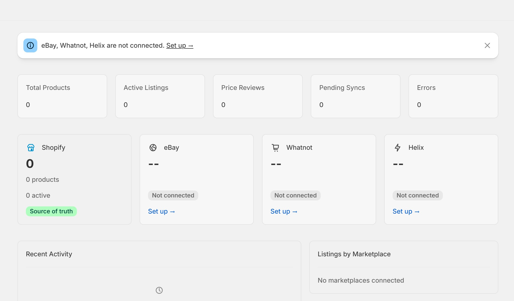

<p align="center">
  
</p>

<p align="center">
  <strong>Multi-marketplace sync for Pokémon card sellers on Shopify</strong>
</p>

<p align="center">
  <a href="#features">Features</a> &middot;
  <a href="#supported-marketplaces">Marketplaces</a> &middot;
  <a href="#getting-started">Getting Started</a> &middot;
  <a href="#deployment">Deployment</a>
</p>

---

Card Yeti Sync is an embedded Shopify app that syncs your Pokémon card inventory across marketplaces from a single dashboard. eBay integration is live; Whatnot supports CSV export, and Helix integration is planned.

<p align="center">
  
</p>

## Features

- **One dashboard for all marketplaces** — View products, listing status, and sync activity from Shopify admin (eBay live, Whatnot CSV, Helix planned)
- **Automatic cross-channel delisting** — When a card sells on one channel, it's delisted on connected marketplaces (eBay live; Whatnot and Helix coming soon)
- **Rich card metadata** — 19 custom metafields (set, number, grade, cert, condition, etc.) mapped to each marketplace's native format
- **Real-time inventory sync** — Webhook-driven updates keep eBay listings accurate as inventory changes
- **Business policy automation** — eBay listings get shipping, payment, and return policies assigned automatically (solves the Marketplace Connect gap)

## Supported Marketplaces

| Marketplace | Integration | Status |
|:------------|:------------|:-------|
| **eBay** | Sell API (OAuth + Inventory API) | Active |
| **Whatnot** | CSV export (API planned) | CSV Ready |
| **Helix** | Full API sync | Planned |

### eBay
Direct integration via the Sell Inventory API with OAuth token management and automatic business policy assignment. Reactive token refresh on 401 responses.

### Whatnot
Generates Whatnot Seller Hub-compatible CSVs with rich descriptions built from card metafields. Full API integration planned when the Whatnot Seller API exits Developer Preview.

### Helix
Integration with the new Pokémon card marketplace featuring 4.9% seller fees and real-time pricing data. Structured data sync with full card metadata. Awaiting API access.

## Tech Stack

| Layer | Technology |
|:------|:-----------|
| **Framework** | React Router v7 (SSR) |
| **UI** | Shopify Polaris Web Components |
| **Language** | TypeScript (strict mode) |
| **Database** | Prisma + SQLite (dev) / PostgreSQL (prod) |
| **Build** | Vite |
| **Hosting** | Fly.io |
| **Auth** | Shopify managed installation + eBay OAuth |

## Getting Started

### Prerequisites

- [Node.js](https://nodejs.org/) >= 20.19
- [Shopify CLI](https://shopify.dev/docs/apps/tools/cli)
- A Shopify Partner account and dev store

### Setup

```bash
# Install dependencies
npm install

# Set up the database
npx prisma migrate dev

# Start the dev server (opens in Shopify admin)
shopify app dev
```

Press `p` in the terminal to open the app URL in your browser.

## Project Structure

```text
app/
  components/                       # Shared UI components
    StatCard.tsx                     #   Reusable stat display card
    ConnectionCard.tsx               #   Marketplace connection card
    EmptyState.tsx                   #   Empty state with icon + CTA
    DisconnectButton.tsx             #   Disconnect with confirmation
    RelativeTime.tsx                 #   SSR-safe relative timestamps
  routes/
    app._index.tsx                   # Dashboard — products, sync status, marketplace overview
    app.ebay.tsx                     # eBay — connect account, policies, sync settings
    app.whatnot.tsx                  # Whatnot — CSV export, inventory breakdown
    app.helix.tsx                    # Helix — connection, roadmap, inventory readiness
    webhooks.products.*.tsx          # Product create/update handlers
    webhooks.orders.create.tsx       # Cross-channel delist on sale
    webhooks.inventory.*.tsx         # Inventory change propagation
  lib/
    marketplace-config.ts            # Shared marketplace constants
    graphql-queries.server.ts        # Shared Shopify GraphQL queries
    ebay-client.server.ts            # eBay OAuth + API client
    ui-helpers.ts                    # Formatting utilities
    use-relative-time.ts             # SSR-safe relative time hook
  db.server.ts                       # Prisma client singleton
  shopify.server.ts                  # Shopify app configuration

prisma/
  schema.prisma                      # Session, MarketplaceAccount, MarketplaceListing, SyncLog
```

## Data Model

```text
MarketplaceAccount ──┐
  shopId              │  1:many
  marketplace         ├──────── MarketplaceListing
  accessToken         │           shopifyProductId
  refreshToken        │           marketplaceId
  tokenExpiry         │           status (active|delisted|error|pending)
  settings (JSON)     │           lastSyncedAt
                      │
                      │
SyncLog ──────────────┘
  marketplace
  action (list|delist|update|reconcile|price_update)
  status (success|error)
  details (JSON)
```

Products in Shopify use custom metafields under the `card` namespace (19 fields covering card identity, grading, condition, and commerce data). These are mapped to each marketplace's native format by the adapter layer.

## Deployment

```bash
# Build for production
npm run build

# Deploy to Fly.io
fly deploy

# Local db proxy
fly proxy 15432:5432 -a correct-name
```

### Environment Variables

Set automatically by Shopify CLI during development. For production, configure on Fly.io:

| Variable | Description |
|:---------|:------------|
| `SHOPIFY_API_KEY` | App API key from Shopify Partners |
| `SHOPIFY_API_SECRET` | App API secret |
| `SHOPIFY_APP_URL` | Production app URL |
| `EBAY_CLIENT_ID` | eBay developer app ID |
| `EBAY_CLIENT_SECRET` | eBay developer app secret |
| `EBAY_RU_NAME` | eBay redirect URL name |
| `EBAY_ENVIRONMENT` | `sandbox` or `production` |
| `DATABASE_URL` | PostgreSQL connection string |
| `NODE_ENV` | `production` |

## Scripts

| Command | Description |
|:--------|:------------|
| `npm run dev` | Start dev server via Shopify CLI |
| `npm run build` | Production build |
| `npm run start` | Serve production build |
| `npm run typecheck` | TypeScript type checking |
| `npm run lint` | ESLint |
| `npm run setup` | Generate Prisma client + run migrations |

---

<p align="center">
  Built for <a href="https://cardyeti.com">Card Yeti</a>
</p>
